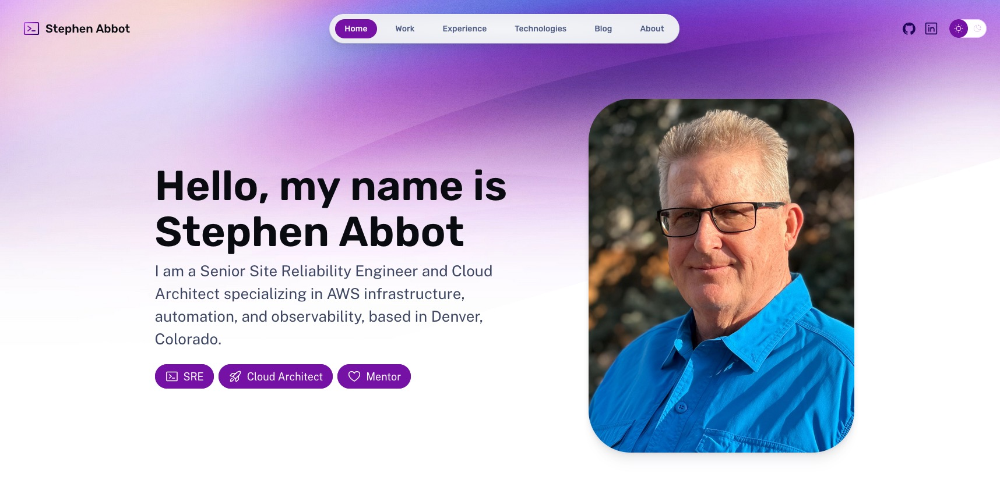

# Stephen Abbot Professional Website



## Professional Portfolio and Technical Blog Platform

This project delivers a comprehensive professional website showcasing AWS infrastructure expertise, site reliability engineering experience, and AI-enhanced development capabilities. Built using Astro with TypeScript, the platform demonstrates enterprise-grade development practices through automated deployment pipelines, content management systems, and scalable hosting architecture. Repository: [website_denverbytes_com](https://github.com/stephenabbot/website_denverbytes_com)

## What Problem This Project Solves

This project addresses the challenge of creating a professional online presence that demonstrates technical capabilities rather than just claiming them.

- **Credibility Gap**: Traditional resumes and portfolios make unverifiable claims about technical expertise
- **Static Presentation**: Most professional websites lack dynamic content management and don't showcase actual technical implementation
- **Manual Maintenance**: Updating and deploying professional websites typically requires manual processes prone to errors
- **Limited Demonstration**: Standard portfolios don't show real-world application of infrastructure automation and best practices
- **Scalability Concerns**: Personal websites often use basic hosting that doesn't demonstrate enterprise-grade architecture understanding

## What This Project Does

This project creates a live demonstration of enterprise-grade web development and AWS infrastructure capabilities.

- **Automated Content Management**: Implements Astro's content collections with TypeScript schema validation for blog posts, work portfolio, and experience timeline
- **Professional Presentation**: Provides structured sections for technical competencies, career progression, and project showcases with honest skill assessment frameworks
- **Enterprise Infrastructure**: Demonstrates AWS best practices through S3 static hosting, CloudFront CDN, Route53 DNS management, and automated SSL certificate handling
- **CI/CD Pipeline**: Implements GitHub Actions for automated testing, building, and deployment with proper error handling and rollback capabilities
- **Responsive Design**: Delivers mobile-first responsive design with dark/light theme support and accessibility compliance
- **SEO Optimization**: Includes proper meta tags, structured data, and performance optimization for search engine visibility

## What This Project Changes

This project establishes a professional online presence while demonstrating technical capabilities through actual implementation.

### Resources Created/Managed

- **S3 Static Website Hosting**: Configured with proper security policies and lifecycle management
- **CloudFront Distribution**: Global CDN with custom domain, SSL certificates, and caching optimization
- **Route53 DNS Management**: Automated DNS configuration with health checks and failover capabilities
- **GitHub Actions Workflows**: Automated deployment pipeline with testing, building, and deployment stages
- **Content Collections**: Structured content management for blog posts, portfolio items, and experience entries

### Functional Changes

- **Professional Online Presence**: Establishes credible professional website with comprehensive technical portfolio
- **Automated Publishing**: Enables content creation and publishing through markdown files with automated deployment
- **Technical Demonstration**: Provides live proof of AWS infrastructure, automation, and development capabilities
- **Career Documentation**: Creates structured presentation of professional experience, skills, and achievements
- **Thought Leadership Platform**: Enables technical blog publishing for sharing expertise and insights

## Quick Start

```sh
npm create astro@latest -- --template portfolio
```

All commands are run from the root of the project, from a terminal:

| Command                   | Action                                           |
| :------------------------ | :----------------------------------------------- |
| `npm install`             | Installs dependencies                            |
| `npm run dev`             | Starts local dev server at `localhost:4321`      |
| `npm run build`           | Build your production site to `./dist/`          |
| `npm run preview`         | Preview your build locally, before deploying     |
| `npm run astro ...`       | Run CLI commands like `astro add`, `astro check` |
| `npm run astro -- --help` | Get help using the Astro CLI                     |

For detailed setup and deployment instructions, see `/docs/prerequisites.md`. For troubleshooting common issues, refer to `/docs/troubleshooting.md`.

## AWS Well-Architected Framework

This project demonstrates alignment with AWS Well-Architected Framework principles:

### Operational Excellence

- **Infrastructure as Code**: All AWS resources defined and managed through automated scripts
- **Automated Deployment**: GitHub Actions pipeline handles testing, building, and deployment with proper error handling
- **Monitoring and Logging**: CloudFront access logs and deployment monitoring for operational visibility

### Security

- **HTTPS Everywhere**: Automatic SSL certificate management through AWS Certificate Manager
- **Access Controls**: Proper S3 bucket policies and CloudFront origin access controls
- **Secure Deployment**: GitHub OIDC authentication for deployment without long-lived credentials

### Reliability

- **Global Distribution**: CloudFront CDN provides global availability and fault tolerance
- **Automated Backup**: S3 versioning and automated backup of deployment artifacts
- **Health Monitoring**: Route53 health checks and CloudFront monitoring for service availability

### Performance Efficiency

- **CDN Optimization**: CloudFront edge locations for global performance optimization
- **Static Site Generation**: Astro's static site generation for optimal loading performance
- **Image Optimization**: Responsive images and modern formats for efficient content delivery

### Cost Optimization

- **Static Hosting**: S3 static website hosting minimizes compute costs
- **Pay-per-Use**: CloudFront and Route53 pricing based on actual usage
- **Efficient Caching**: Proper cache headers and CDN configuration to minimize origin requests

### Sustainability

- **Serverless Architecture**: No always-on compute resources reducing environmental impact
- **Efficient Content Delivery**: CDN reduces data transfer and improves resource utilization
- **Automated Operations**: Reduces manual operational overhead and resource waste

## Technologies Used

| Technology | Purpose | Implementation |
|------------|---------|----------------|
| Kiro CLI with Claude | Primary development tool and AI collaboration | Used for accelerated development, code generation, and architectural decision-making throughout the project |
| Astro | Static site generator and web framework | Implements content collections, TypeScript integration, and component-based architecture for maintainable code |
| TypeScript | Type-safe JavaScript development | Provides compile-time type checking for content schemas, component props, and configuration objects |
| AWS S3 | Static website hosting and storage | Configured with bucket policies, versioning, and lifecycle management for secure and efficient hosting |
| AWS CloudFront | Global content delivery network | Implements custom domain, SSL certificates, caching strategies, and global edge distribution |
| AWS Route53 | DNS management and domain routing | Manages DNS records, health checks, and domain configuration with automated certificate validation |
| AWS Certificate Manager | SSL/TLS certificate management | Provides automated certificate provisioning, renewal, and validation for HTTPS security |
| GitHub Actions | CI/CD pipeline automation | Implements automated testing, building, deployment, and rollback capabilities with proper error handling |
| GitHub OIDC | Secure deployment authentication | Enables secure AWS access without long-lived credentials using OpenID Connect integration |
| Bash | Deployment and automation scripting | Custom deployment scripts for AWS resource management, validation, and operational tasks |
| Git | Version control and collaboration | Source code management with branching strategies and automated deployment triggers |
| Node.js | JavaScript runtime environment | Powers the Astro build process and development server with npm package management |
| CSS3 | Styling and responsive design | Implements responsive layouts, dark/light themes, and accessibility-compliant styling |
| HTML5 | Semantic markup and structure | Provides accessible, SEO-optimized markup with proper semantic structure |
| Markdown | Content authoring format | Enables structured content creation for blog posts, portfolio items, and documentation |

## Copyright

© 2025 Stephen Abbot. All rights reserved.
